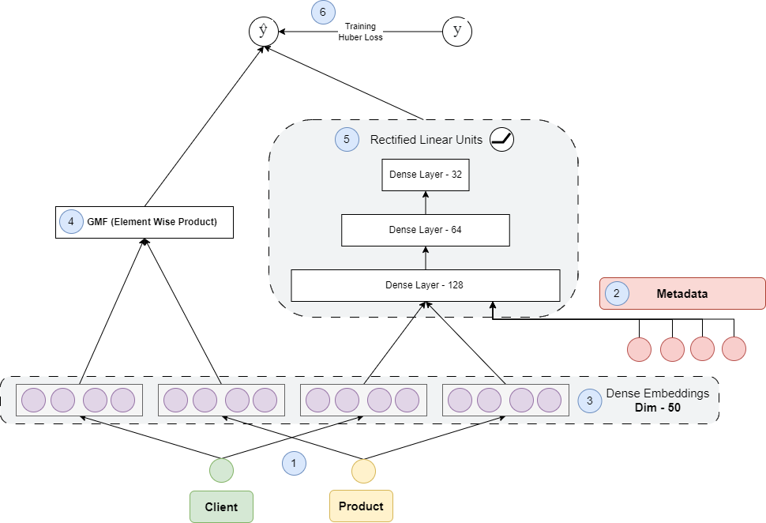

# Sistema de recomendación Hybrid NCF

En este repositorio podrás encontrar el código relacionado con la construcción del sistema de recomendación Hybrid NCF y su proceso de investigación, dividiendo sus secciones en:

1. Análisis exploratorio de datos
2. Transformación de datos
3. Selección de variables
4. Machine Learning
5. Deep Learning
